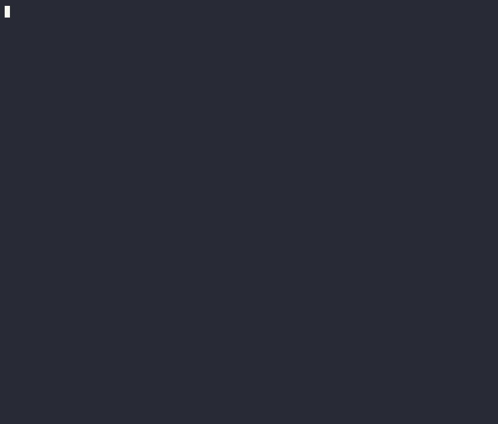

# snake.cpp

Terminal based snake game written in C++ with ncurses.

[](https://asciinema.org/a/678040)

## 📝 Table of Contents

- [About](#about)
- [Features](#features)
- [How to build](#how-to-build)
- [How to run](#how-to-run)
- [Contributing](#contributing)
- [License](#license)

## 📕 About <a name="about"></a>

snake.cpp is a terminal based snake game written in C++. It can be played from any terminal that supports ncurses.

## 🌟 Features <a name="features"></a>

- Smooth gameplay
- Score tracking
- Terminal-based, play anywhere

## 🛠️ How to build <a name="how-to-build"></a>

snake.cpp uses [bazel](https://bazel.build/) as its build system. To build game, you need to have bazel installed on your system or use the dev container provided in the repository.

If bazel is not installed in your system, install it or use [bazelisk](https://github.com/bazelbuild/bazelisk).

Use bazel to build the game:

```bash
bazel build snake
```

## 🚀 How to run <a name="how-to-run"></a>

To run the game using bazel, use the following command:

```bash
bazel run snake
```

Alternatively, download the latest binary from the release page and run it.

## 👥 Contributing <a name="contributing"></a>
Contributions are welcome! Please read the [contributing guidelines](CONTRIBUTING.md) before getting started.

## 📝 License <a name="license"></a>

[MIT License](LICENSE)
